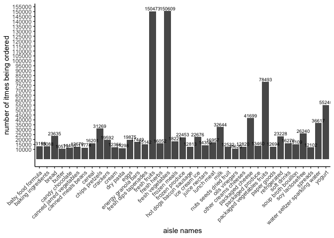

p8105\_hw3\_xm2229
================
Xiaoyue Ma
10/13/2019

# Problem 1

load the data set from the
    library

``` r
library(tidyverse)
```

    ## ── Attaching packages ────────────────────────────────────────────────────────────────────────────────────────────────── tidyverse 1.2.1 ──

    ## ✔ ggplot2 3.2.1     ✔ purrr   0.3.2
    ## ✔ tibble  2.1.3     ✔ dplyr   0.8.3
    ## ✔ tidyr   1.0.0     ✔ stringr 1.4.0
    ## ✔ readr   1.3.1     ✔ forcats 0.4.0

    ## ── Conflicts ───────────────────────────────────────────────────────────────────────────────────────────────────── tidyverse_conflicts() ──
    ## ✖ dplyr::filter() masks stats::filter()
    ## ✖ dplyr::lag()    masks stats::lag()

``` r
library(p8105.datasets)
data("instacart")
```

``` r
skimr::skim(instacart)
```

    ## Skim summary statistics
    ##  n obs: 1384617 
    ##  n variables: 15 
    ## 
    ## ── Variable type:character ────────────────────────────────────────────────────────────────────────────────────────────────────────────────
    ##      variable missing complete       n min max empty n_unique
    ##         aisle       0  1384617 1384617   3  29     0      134
    ##    department       0  1384617 1384617   4  15     0       21
    ##      eval_set       0  1384617 1384617   5   5     0        1
    ##  product_name       0  1384617 1384617   3 159     0    39123
    ## 
    ## ── Variable type:integer ──────────────────────────────────────────────────────────────────────────────────────────────────────────────────
    ##                variable missing complete       n       mean        sd p0
    ##       add_to_cart_order       0  1384617 1384617       8.76      7.42  1
    ##                aisle_id       0  1384617 1384617      71.3      38.1   1
    ##  days_since_prior_order       0  1384617 1384617      17.07     10.43  0
    ##           department_id       0  1384617 1384617       9.84      6.29  1
    ##               order_dow       0  1384617 1384617       2.7       2.17  0
    ##       order_hour_of_day       0  1384617 1384617      13.58      4.24  0
    ##                order_id       0  1384617 1384617 1706297.62 989732.65  1
    ##            order_number       0  1384617 1384617      17.09     16.61  4
    ##              product_id       0  1384617 1384617   25556.24  14121.27  1
    ##               reordered       0  1384617 1384617       0.6       0.49  0
    ##                 user_id       0  1384617 1384617   1e+05     59487.15  1
    ##     p25     p50     p75    p100     hist
    ##       3       7      12      80 ▇▃▁▁▁▁▁▁
    ##      31      83     107     134 ▃▇▃▃▇▅▅▆
    ##       7      15      30      30 ▂▅▃▃▁▂▁▇
    ##       4       8      16      21 ▃▇▂▁▂▆▁▃
    ##       1       3       5       6 ▇▅▃▃▁▃▅▅
    ##      10      14      17      23 ▁▁▃▇▇▇▅▂
    ##  843370 1701880 2568023 3421070 ▇▇▇▇▇▇▇▇
    ##       6      11      21     100 ▇▂▁▁▁▁▁▁
    ##   13380   25298   37940   49688 ▆▆▇▇▇▆▇▇
    ##       0       1       1       1 ▆▁▁▁▁▁▁▇
    ##   51732   1e+05  154959  206209 ▇▇▇▇▇▇▇▇

**The dataset is derived from the original “instacart” data. The dataset
has 1384617 rows and 15 columns. The structure of the data is tbl\_df,
tbl, data.frame. Variables include order\_id, product\_id,
add\_to\_cart\_order, reordered, user\_id, eval\_set, order\_number,
order\_dow, order\_hour\_of\_day, days\_since\_prior\_order,
product\_name, aisle\_id, department\_id, aisle, department. Key
variables descriptions can be find on**
<http://p8105.com/dataset_instacart.html>:

  - order\_id: order identifier
  - product\_id: product identifier
  - add\_to\_cart\_order: order in which each product was added to cart
  - reordered: 1 if this prodcut has been ordered by this user in the
    past, 0 otherwise
  - user\_id: customer identifier
  - eval\_set: which evaluation set this order belongs in (Note that the
    data for use in this class is exclusively from the “train”
    eval\_set)
  - order\_number: the order sequence number for this user (1=first,
    n=nth)
  - order\_dow: the day of the week on which the order was placed
  - order\_hour\_of\_day: the hour of the day on which the order was
    placed
  - days\_since\_prior\_order: days since the last order, capped at 30,
    NA if order\_number=1
  - product\_name: name of the product
  - aisle\_id: aisle identifier
  - department\_id: department identifier
  - aisle: the name of the aisle
  - department: the name of the department

**Here are some exmaples of some observations in from the dataset:**

``` r
head(instacart, 5)
```

    ## # A tibble: 5 x 15
    ##   order_id product_id add_to_cart_ord… reordered user_id eval_set
    ##      <int>      <int>            <int>     <int>   <int> <chr>   
    ## 1        1      49302                1         1  112108 train   
    ## 2        1      11109                2         1  112108 train   
    ## 3        1      10246                3         0  112108 train   
    ## 4        1      49683                4         0  112108 train   
    ## 5        1      43633                5         1  112108 train   
    ## # … with 9 more variables: order_number <int>, order_dow <int>,
    ## #   order_hour_of_day <int>, days_since_prior_order <int>,
    ## #   product_name <chr>, aisle_id <int>, department_id <int>, aisle <chr>,
    ## #   department <chr>

The goal is to do some exploration of this dataset. To that end, write a
short description of the dataset, noting the size and structure of the
data, describing some key variables, and giving illstrative examples of
observations. Then, do or answer the following (commenting on the
results of each):

  - How many aisles are there, and which aisles are the most items
    ordered from?

**There are 134 aisles and aisle \#83, which is the fresh vegetables
aisle, has the most items.**

  - Make a plot that shows the number of items ordered in each aisle,
    limiting this to aisles with more than 10000 items ordered. Arrange
    aisles sensibly, and organize your plot so others can read it.

<!-- end list -->

``` r
library(ggplot2)
instacart %>%
  count(aisle, name = "n_orders") %>%
  filter(n_orders > 10000) %>%
  arrange(aisle) %>%
  ggplot(aes(x = aisle, y= n_orders)) + 
  geom_bar(stat = "identity") + 
  theme_classic() + 
  theme(axis.text.x = element_text(angle = 45, hjust = 1)) + 
  scale_y_continuous(breaks = seq(10000, 160000, 5000)) + 
  labs(x = "aisle names", y = "number of itmes being ordered") + 
  geom_text(aes(label=n_orders), vjust = -0.3, size=2.5)
```

<!-- -->

  - Make a table showing the three most popular items in each of the
    aisles “baking ingredients”, “dog food care”, and “packaged
    vegetables fruits”. Include the number of times each item is ordered
    in your table.

<!-- end list -->

``` r
instacart %>% 
  filter(aisle == "baking ingredients" | aisle == "dog food care" | aisle == "packaged vegetables fruits") %>%
  group_by(aisle, product_name) %>%
  summarise(count = sum(order_number)) %>%
  arrange(desc(count), .by_group = TRUE) %>%
  group_by(aisle) %>%
  slice(1:3) %>%
  knitr::kable()
```

| aisle                      | product\_name                                 |  count |
| :------------------------- | :-------------------------------------------- | -----: |
| baking ingredients         | Light Brown Sugar                             |   8605 |
| baking ingredients         | Cane Sugar                                    |   6244 |
| baking ingredients         | Organic Vanilla Extract                       |   6003 |
| dog food care              | Standard Size Pet Waste bags                  |    675 |
| dog food care              | Beef Stew Canned Dog Food                     |    631 |
| dog food care              | Snack Sticks Chicken & Rice Recipe Dog Treats |    589 |
| packaged vegetables fruits | Organic Baby Spinach                          | 171301 |
| packaged vegetables fruits | Organic Raspberries                           | 113932 |
| packaged vegetables fruits | Organic Blueberries                           |  86765 |

  - Make a table showing the mean hour of the day at which Pink Lady
    Apples and Coffee Ice Cream are ordered on each day of the week;
    format this table for human readers (i.e. produce a 2 x 7 table).

<!-- end list -->

``` r
instacart %>% 
  filter(product_name %in% c("Pink Lady Apples", "Coffee Ice Cream")) %>% 
  group_by(product_name, order_dow) %>% 
  summarise(mean_hour = mean(order_hour_of_day)) %>% 
  spread(key = order_dow, value = mean_hour) %>% # produce a 2*7 table
  knitr::kable()
```

| product\_name    |        0 |        1 |        2 |        3 |        4 |        5 |        6 |
| :--------------- | -------: | -------: | -------: | -------: | -------: | -------: | -------: |
| Coffee Ice Cream | 13.77419 | 14.31579 | 15.38095 | 15.31818 | 15.21739 | 12.26316 | 13.83333 |
| Pink Lady Apples | 13.44118 | 11.36000 | 11.70213 | 14.25000 | 11.55172 | 12.78431 | 11.93750 |

# Problem 2

Load in the dataset

``` r
data("brfss_smart2010")
```

First, do some data cleaning:

  - format the data to use appropriate variable names;
  - focus on the “Overall Health” topic
  - include only responses from “Excellent” to “Poor”
  - organize responses as a factor taking levels ordered from “Poor” to
    “Excellent”

<!-- end list -->

``` r
brfss = brfss_smart2010 %>% 
  janitor::clean_names() %>%
  filter(topic == "Overall Health") %>%
  filter(response %in% c("Excellent", "Very good", "Good", "Fair", "Poor")) %>% 
  mutate(response = forcats::fct_relevel(response, c("Excellent", "Very good", "Good", "Fair", "Poor")))

brfss
```

    ## # A tibble: 10,625 x 23
    ##     year locationabbr locationdesc class topic question response
    ##    <int> <chr>        <chr>        <chr> <chr> <chr>    <fct>   
    ##  1  2010 AL           AL - Jeffer… Heal… Over… How is … Excelle…
    ##  2  2010 AL           AL - Jeffer… Heal… Over… How is … Very go…
    ##  3  2010 AL           AL - Jeffer… Heal… Over… How is … Good    
    ##  4  2010 AL           AL - Jeffer… Heal… Over… How is … Fair    
    ##  5  2010 AL           AL - Jeffer… Heal… Over… How is … Poor    
    ##  6  2010 AL           AL - Mobile… Heal… Over… How is … Excelle…
    ##  7  2010 AL           AL - Mobile… Heal… Over… How is … Very go…
    ##  8  2010 AL           AL - Mobile… Heal… Over… How is … Good    
    ##  9  2010 AL           AL - Mobile… Heal… Over… How is … Fair    
    ## 10  2010 AL           AL - Mobile… Heal… Over… How is … Poor    
    ## # … with 10,615 more rows, and 16 more variables: sample_size <int>,
    ## #   data_value <dbl>, confidence_limit_low <dbl>,
    ## #   confidence_limit_high <dbl>, display_order <int>,
    ## #   data_value_unit <chr>, data_value_type <chr>,
    ## #   data_value_footnote_symbol <chr>, data_value_footnote <chr>,
    ## #   data_source <chr>, class_id <chr>, topic_id <chr>, location_id <chr>,
    ## #   question_id <chr>, respid <chr>, geo_location <chr>

Using this dataset, do or answer the following (commenting on the
results of each):

  - In 2002, which states were observed at 7 or more locations? What
    about in 2010?

<!-- end list -->

``` r
answer = brfss %>% 
  filter(year == 2002) %>% 
  group_by(locationabbr) %>% 
  summarise(n = n_distinct(locationdesc)) %>% 
  filter(n >= 7)
```

**In 2002 CT, FL, MA, NC, NJ, PA were observed at 7 or more locations.**

``` r
answer_2010 = brfss %>% 
  filter(year == 2010) %>% 
  group_by(locationabbr) %>% 
  summarise(n = n_distinct(locationdesc)) %>% 
  filter(n >= 7)
```

**In 2010 CA, CO, FL, MA, MD, NC, NE, NJ, NY, OH, PA, SC, TX, WA were
observed at 7 or more locations.**

  - Construct a dataset that is limited to Excellent responses, and
    contains, year, state, and a variable that averages the data\_value
    across locations within a state. Make a “spaghetti” plot of this
    average value over time within a state (that is, make a plot showing
    a line for each state across years – the geom\_line geometry and
    group aesthetic will help).

<!-- end list -->

``` r
brfss %>%
  filter(response == "Excellent") %>%
  group_by(year, locationabbr, locationdesc) %>%
  summarise(average_v = mean(data_value)) %>%
  ggplot(aes(x = year, y = average_v)) + 
  geom_line(aes(group = locationabbr)) +
  labs(
    title = "Mean data value in each state from 2002 to 2010",
    x = "Year",
    y = "Average Data Value"
  )
```

<!-- -->

  - Make a two-panel plot showing, for the years 2006, and 2010,
    distribution of data\_value for responses (“Poor” to “Excellent”)
    among locations in NY State.

<!-- end list -->

``` r
brfss %>%
  filter(locationabbr == "NY", year %in% c(2006, 2010)) %>%
  ggplot(aes(x = response, y = data_value)) + 
  geom_boxplot() +
  labs(
    title = "Density distribution of data_value for year 2006 and 2010",
    x = "data_value",
    y = "density"
  )+
  facet_grid(~year)
```

<!-- -->

# Problem 3

load in the dataset

``` r
accel <- read.csv('./data/accel_data.csv')
```

  - Load, tidy, and otherwise wrangle the data. Your final dataset
    should include all originally observed variables and values; have
    useful variable names; include a weekday vs weekend variable; and
    encode data with reasonable variable classes. Describe the resulting
    dataset (e.g. what variables exist, how many observations, etc).

<!-- end list -->

``` r
accel_cleaned = accel %>% 
  janitor::clean_names() %>%
  mutate(
    weekday_vs_weekend = case_when( 
      day %in% c("Monday","Tuesday","Wednesday","Thursday","Friday") ~ "Weekday",
      day %in% c("Saturday","Sunday") ~ "Weekend")) %>% 
  select(week, day_id, day, weekday_vs_weekend, everything()) 
```

**The dataset is derived from the heart activity collected from an
accelerometer of a patient in weeks. The dataset has 35 rows and 1444
columns. The structure of the data is data.frame. Key variables are: **

  - week: number of week since the data collection begins

  - day\_id: day identifier

  - day: day of the week when the data is collected

  - weekdays: 1 if it is a weekday, 0 otherwise.

  - activity\_\* : are the activity counts for each minute of a 24-hour
    day starting at midnight

  - Traditional analyses of accelerometer data focus on the total
    activity over the day. Using your tidied dataset, aggregate accross
    minutes to create a total activity variable for each day, and create
    a table showing these totals. Are any trends apparent?

<!-- end list -->

``` r
accel_cleaned %>%
  pivot_longer(
    activity_1:activity_1440,
    names_to = "activity",
    values_to = "activity_sum"
  ) %>%
  group_by(week, day) %>%
  summarise(
    day_activity = sum(activity_sum)
    ) %>%
  mutate(day_order = case_when(
        day == "Monday" ~ 1,
    day == "Tuesday" ~ 2,
    day == "Wednesday" ~ 3,
    day == "Thursday" ~ 4,
    day == "Friday" ~ 5,
    day == "Saturday" ~ 6,
    day == "Sunday" ~ 7
  )) %>%
  arrange(day_order) %>%
  select(week, day, day_activity) %>%
  pivot_wider(names_from = week, values_from = day_activity)%>%
  knitr::kable()
```

| day       |         1 |      2 |      3 |      4 |      5 |
| :-------- | --------: | -----: | -----: | -----: | -----: |
| Monday    |  78828.07 | 295431 | 685910 | 409450 | 389080 |
| Tuesday   | 307094.24 | 423245 | 381507 | 319568 | 367824 |
| Wednesday | 340115.01 | 440962 | 468869 | 434460 | 445366 |
| Thursday  | 355923.64 | 474048 | 371230 | 340291 | 549658 |
| Friday    | 480542.62 | 568839 | 467420 | 154049 | 620860 |
| Saturday  | 376254.00 | 607175 | 382928 |   1440 |   1440 |
| Sunday    | 631105.00 | 422018 | 467052 | 260617 | 138421 |

**There is no apparent trend**

  - Accelerometer data allows the inspection activity over the course of
    the day. Make a single-panel plot that shows the 24-hour activity
    time courses for each day and use color to indicate day of the week.
    Describe in words any patterns or conclusions you can make based on
    this graph.

<!-- end list -->

``` r
accel_cleaned %>%
  pivot_longer(
    activity_1:activity_1440,
    names_to = "activity",
    values_to = "activity_sum"
  ) %>%
  group_by(day_id, day) %>%
  summarise(
    day_activity = sum(activity_sum)
    ) %>%
  ggplot(aes(x = day_id, y=day_activity, color=day)) + 
  geom_point(alpha = .7) + 
  geom_line() +
  labs(
    title = "24-hour activity for each day",
    x = "day",
    y = "24-hour activity"
  )
```

<!-- -->

**There is obvious trend.**
